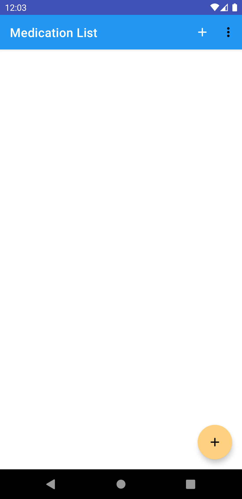
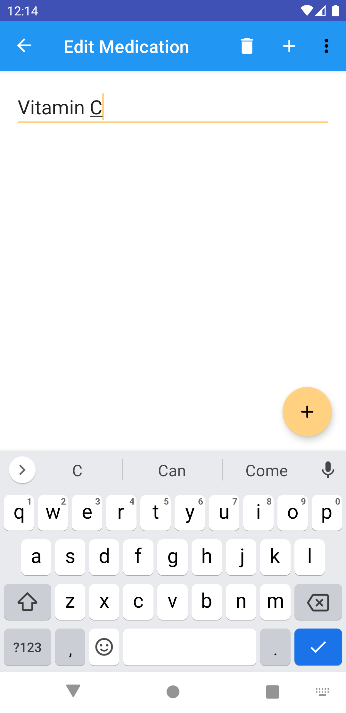
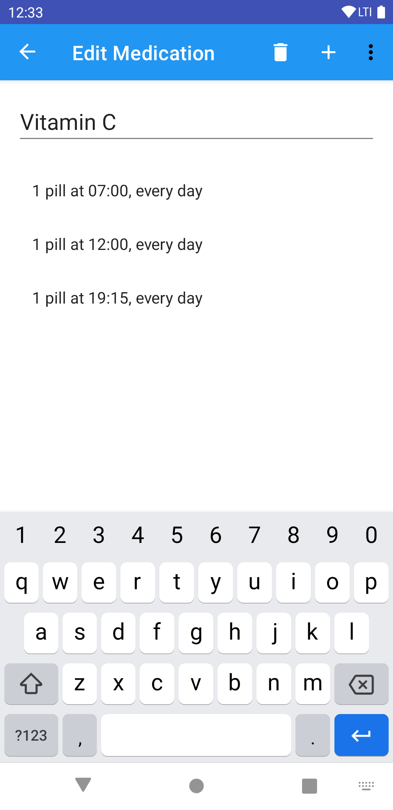
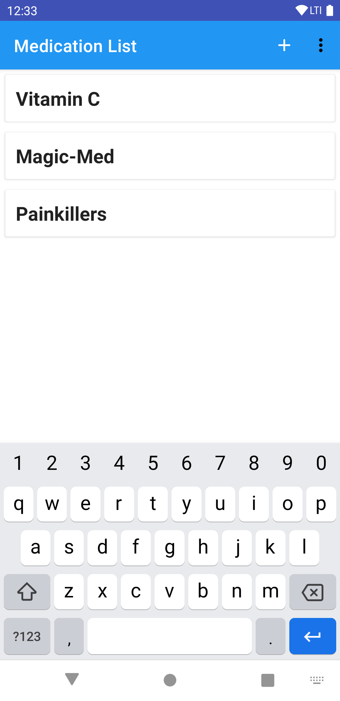
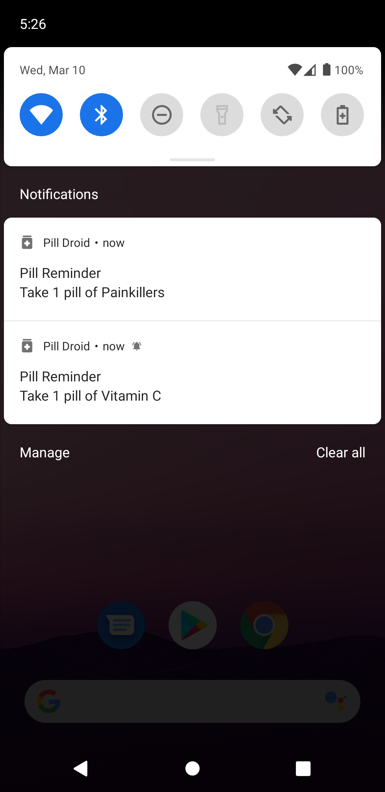

# PillDroid

## About

PillDroid is a very simple app to help you remember to take your medications. It is very useful for people who need to take multiple kinds and doses of pills each day.

_How does it work?_

Actually it's very simple. You can add your medications to the app, and PillDroid will remind you when you need to take them. For each medication you need to supply the dosage, input frequency and time. You have total control over the names and dosages of the medications.

## User Guide

### Adding a Medication

When you open the app for the first time, it will show the _Medication List_ screen, and initially it will be empty.

You can add a new medication with either the floating action button in the bottom right corner, or tapping the `+` sign in the toolbar.

This will bring you to the next screen, where you can enter the medication name.
While there is no restriction on what you can put in here, it works best if you enter a descriptive name, that identifies the medication (brand, agent, substance), or refers to the condition you are taking it for. Some good examples:
   * Vitamin C
   * Anti-depressants
   * Lithium
   * Algopyrin

### Adding a Dosage to the Medication

The next screen is about telling PillDroid when, and how much of the medication you need to take.

   * __dose name__: enter a name for this dose. The default is _"1 pill"_, but you can change it to anything you like, for example:
      - 150mg
      - 1/2 teaspoon
      - 2 pieces
   * __frequency__: this indicates how often the alarm will repeat. The default is _daily_, but you can change it to be less frequent if you wish.
   * __alarm time__: the hour and minute of the alarm

#### Tip:

Add multiple doses of the same medication when you need to take it more than once per day.

For example:

   * one pill @7AM
   * one pill @12PM
   * one pill @7:15PM

from the same medicine, every day would look like the below screenshot.

### Editing medications/dosages

To edit a medication, locate it in the _Medication List_ screen, and tap its name. To change its name, simply tap on it, and change it.

To change the associated dosages, click on a dosage in the list, and change it on the next screen.

### Delete a medication

   1. locate the medication in the _Medication List_ screen
   2. tap its name to enter the details screen
   3. press the _trash can_ button on the main toolbar or select the _delete_ menu item from the context menu

### Delete a dosage

   1. locate the medication in the _Medication List_ screen to which the dosage belongs to
   2. tap the medication name to enter the details screen
   3. locate the dosage to delete in the list
   4. tap the dosage in the list
   5. press the _trash can_ button on the main toolbar or select the _delete_ menu item from the context menu

### Saving the medication list

Your changes are automatically saved whenever you edit something.

Alarms however are not primed, until you close the app or put in the background. So in order to prime the alarms, you can do any of the following:
   * press the home button on your device
   * press the task view button on your device
   * close the app

When you receive the notifications for the medications, it should look like this:

## FAQ

### Can I create two medications with the same name?
Yes

### Can I create two doses with alarms at the same time?
Yes, you will get two notifications at the same time.

### Can I create a backup of my medication list?
Unfortunately at this time only pen&paper is supported :)

### I reinstalled the app, and now my medication list is empty! Why?
Please read the privacy section below.

## Privacy

PillDroid is an ethical app, created in the hope of it being useful to someone.
You don't need to sign-up or create an account in order to use PillDroid (in fact, no such feature is even supported).

   * PillDroid does __not__ contain __any__ trackers.
   * PillDroid does __not__ store or send __any__ user data.
   * PillDroid does __not__ need any special Android permissions.

PillDroid is an open source project under the GPLv3. Feel free to check out the source code, contribute or donate to the project.

All data is stored locally, on your phone. This also means, that if you uninstall the app your medications list is erased from the device. Next time you install it you will need to add the again.